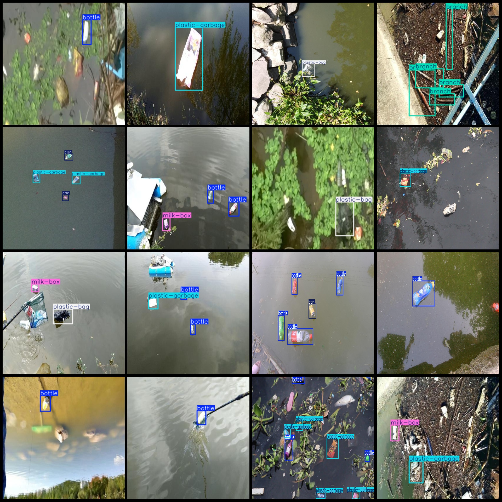
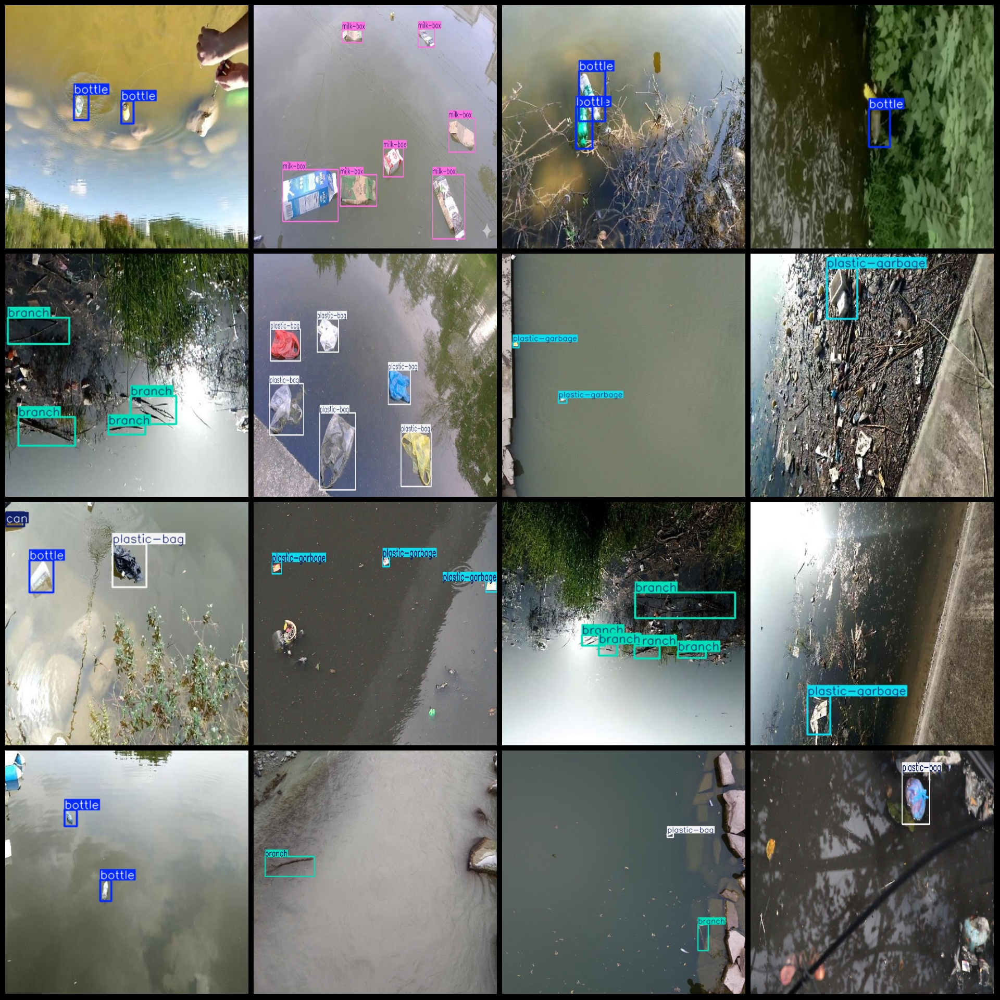

# Drone Perspective Riverside Trash Bottle Branch Can Plastic Detection Dataset VOC+YOLO Format, 2247 Images in 1 Category

Dataset format: Pascal VOC format + YOLO format (txt file without split path, only containing jpg images and corresponding VOC format xml files and YOLO format txt files)
Number of images (jpg file count): 2247
Number of annotations (xml file count): 2247
Number of annotations (txt file count): 2247
Number of categories: 6
Annotation category names (Note that the order of categories in the yolo format does not match this, but refer to the labels folder's classes.txt for consistency): ["bottle", "branch", "can", "milk-box", "plastic-bag", "plastic-garbage"]
Each category annotation box count:
- bottle (bottle) box count = 1521
- branch (branch) box count = 569
- can (can) box count = 566
- milk-box (milk box) box count = 526
- plastic-bag (plastic bag) box count = 663
- plastic-garbage (plastic garbage) box count = 1112
Total box count: 4957
Image resolution: Multi-resolution images, such as 416x416, 640x640 etc.
Drone: DJI MAVIC 3
Collecting height: 5-20m
Collecting angle: 60-90°
Using labeling tool: labelImg
Labeling rules: Draw a rectangle around the category
Important note: No special declarations are currently available
Special statement: This dataset does not guarantee the accuracy of the trained models or weight files
Image preview:

## Images

Here is a pay link on Stripe ( https://buy.stripe.com/3cs8yP7sY87d0vu9AB ). Please contact me lonlonago@foxmail.com after funding $89, and I will send you a complete data files , thank you!

